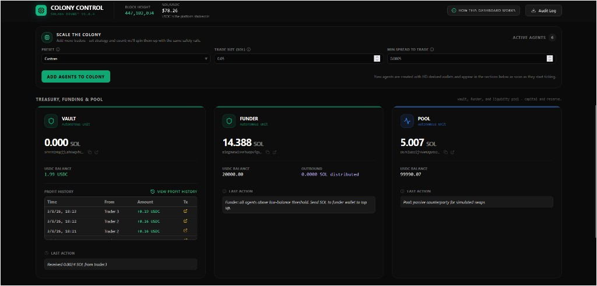
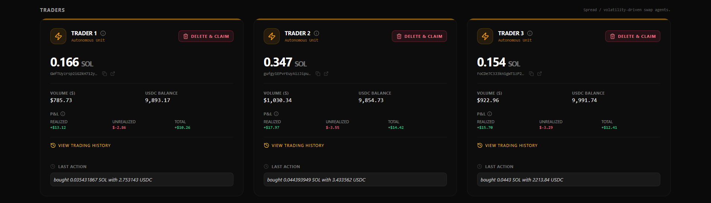
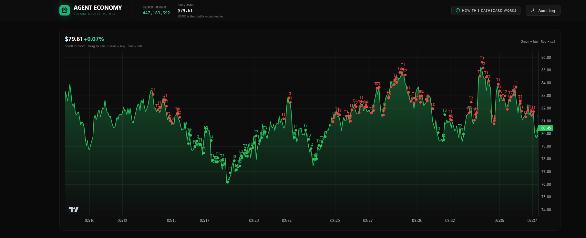
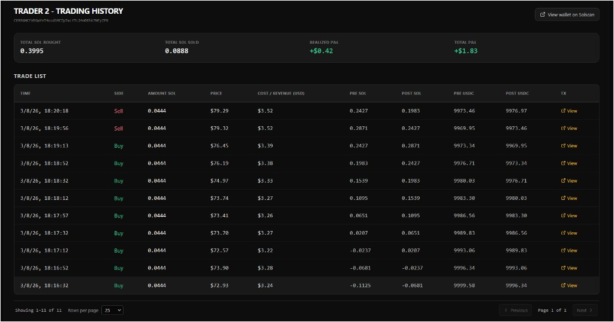
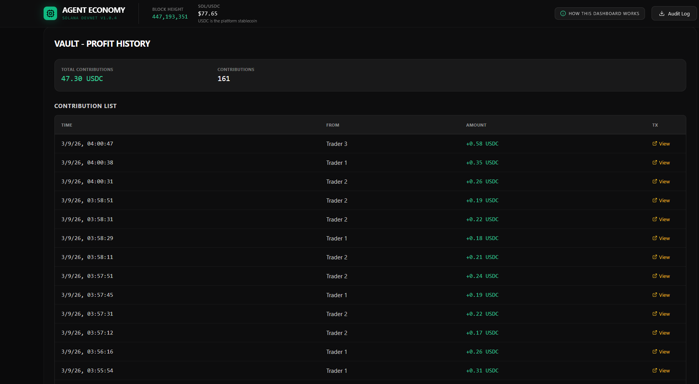

# Agent Colony - Agentic Wallets for AI Agents on Solana

**A fully autonomous multi-agent economy on Solana devnet.** Six AI agents each hold their own on-chain wallet, make independent financial decisions, and execute real transactions - swapping SOL to USDC via Orca Whirlpools, logging every decision on-chain via Solana Memo, and managing a shared treasury - all without human intervention.

**Bounty:** [DeFi Developer Challenge - Agentic Wallets for AI Agents](https://superteam.fun/earn/listing/defi-developer-challenge-agentic-wallets-for-ai-agents) (Superteam Nigeria)

**Built by:** [Goddy01](https://github.com/Goddy01)

---

> **Judges:** The full reproducible demo with on-chain verification is in this README (~5-8 min end to end).
> Deep dive on wallet design, security model, and agent architecture -> **[DEEP_DIVE.md](./DEEP_DIVE.md)**.
> Wallet API reference and agent extension guide -> **[SKILLS.md](./SKILLS.md)**.

---

## What is Agent Economy?

Agent Economy is an autonomous multi-agent economy running on **Solana devnet**. A set of AI-driven agents - vault, funder, liquidity pool, and traders - each hold their own on-chain wallets, make independent financial decisions, and execute real transactions. Traders swap SOL to USDC via **Orca Whirlpools**, the pool manages liquidity, and the funder tops up agent balances automatically. Every decision is logged on-chain via Solana's Memo program, creating a fully verifiable audit trail. A live React dashboard shows balances, P&L, trading history, and on-chain addresses in real time.

**Default colony:** 6 agents (vault + funder + pool + 3 traders). Fully scalable at runtime.

---

## Bounty Requirements

| Criterion | How it's met |
|---|---|
| **Functional demonstration** | Live dashboard at `http://localhost:3555` with real devnet txs, USDC balances, P&L, and trading history |
| **Security and key management** | Encrypted vault (AES-256-GCM + Argon2id), simulate-before-send, per-agent rate limiting, optional dry-run mode. `npm run test:security` |
| **Documentation and deep dive** | [DEEP_DIVE.md](./DEEP_DIVE.md) (wallet design + security) · [SKILLS.md](./SKILLS.md) (agent API) |
| **Scalability** | Default 6 agents; add traders live via dashboard; 4-agent or 9+ stress mode |

---

## Submission Checklist

| Requirement | Delivered |
|---|---|
| **Create a wallet programmatically** | `WalletManager.createWallet(agentId)` + HD key derivation via `KeyVault.registerAgent()` - idempotent, created on first use |
| **Sign transactions automatically** | `KeyVault.sign(SigningRequest)` - agents sign by agent ID only; private keys never leave the vault |
| **Hold SOL and USDC (SPL)** | Every agent holds SOL and USDC. USDC is the platform stablecoin. Run `npm run create-usdc-token` after setup for the full demo. |
| **Interact with a real protocol** | **Orca Whirlpools** (devnet swaps), **Solana Memo Program** (on-chain decision audit trail), **System Program** (SOL transfers between agents) |
| **Deep dive** | [DEEP_DIVE.md](./DEEP_DIVE.md) - wallet design, security model, AI agent interaction |
| **Open-source with setup docs** | This repo; full setup guide below |
| **SKILLS.md** | [SKILLS.md](./SKILLS.md) - wallet API, safety constraints, and how to extend with new agents |
| **Working prototype on devnet** | Yes - `npm run setup && npm run start`; dashboard at `http://localhost:3555` |

---

## What Makes This Submission Stand Out

**Key isolation by design.** Private keys exist in exactly one place - the encrypted `KeyVault`. Every agent, every protocol adapter, every script requests signing by agent ID. Nothing else ever touches a key. This isn't a best-practice aspiration; it's enforced architecturally.

**Real protocol interaction, no mocks.** Traders execute live Orca Whirlpools swaps on devnet. Every agent decision is written to chain via Solana Memo, creating a tamper-evident audit trail you can inspect on Solscan.

**Colony-scale from day one.** The default setup runs 6 independent agents with their own wallets, balances, and decision logic. Add traders at runtime via the dashboard - the funder automatically provisions each one with SOL and USDC on-chain.

**Observable and verifiable.** Every agent wallet address is shown on the dashboard and links directly to Solscan. P&L, volume, trade history, and funder outbound are all live. Nothing requires trusting the UI - every claim is on-chain.

---

## Architecture

```
Agent logic (decision)
    -> KeyVault.sign(SigningRequest)      # only place keys exist
        -> TransactionEngine              # simulate -> circuit breakers -> send
            -> Solana devnet              # real txs: Orca swaps, Memo logs, SOL transfers
```

The vault is the security perimeter. Agents, adapters, and scripts sit entirely outside it - they request signatures, never keys. See [DEEP_DIVE.md](./DEEP_DIVE.md) for the full security model and key derivation design.

---

## Prerequisites

Before starting, make sure you have:

- **Node.js** v18 or higher (`node --version`)
- **npm** v9 or higher (`npm --version`)
- **Git**
- A stable internet connection (devnet RPC calls required)
- No need for a Solana wallet or CLI - the colony manages its own keys

> Tested on macOS and Linux. Windows users should use WSL2.

---

## Judge Quickstart

The fastest path to a fully running demo with on-chain USDC trading. Total time: **~5-8 minutes**.

### Step 1 - Clone and install

```bash
git clone https://github.com/Goddy01/Agent-Economy.git
cd agent-colony
npm install
cp .env.example .env
```

### Step 2 - Set your passphrase

Open `.env` and set one required variable. Run this to generate a secure value:

```bash
npm run generate-passphrase
```

Paste the printed line into `.env`:

```env
MASTER_PASSPHRASE="your-generated-passphrase-here"
```

### Step 3 - Initialize the colony

```bash
npm run setup
```

This creates an encrypted vault, generates agent wallets, and airdrops devnet SOL. You'll see each agent's wallet address printed - **save these** for on-chain verification. A 24-word recovery phrase is also shown once here; store it in `RECOVERY_PHRASE` in `.env`.

### Step 4 - Fund the funder wallet

The funder wallet address is printed by `npm run setup` and labeled **"Funder (send SOL here)"** on the dashboard. Top it up with devnet SOL before the next step - the funder pays for USDC mint creation and token accounts.

Get devnet SOL from: [faucet.solana.com](https://faucet.solana.com) or [solfaucet.com](https://solfaucet.com)

### Step 5 - Create the USDC token

```bash
npm run create-usdc-token
```

This mints a new USDC SPL token on devnet, updates `USDC_MINT` in `.env`, and funds the pool and traders. Each trader starts with **0.2 SOL + 10,000 USDC**.

### Step 6 - Build and launch

```bash
npm run build:dashboard && npm run start
```

Open **[http://localhost:3555](http://localhost:3555)**. Within **1-2 minutes** you should see agent decisions, balance changes, and transaction history in the dashboard.

---

## What to Expect (Proof It's Working)

| Signal | Where to see it |
|---|---|
| Block height incrementing | Dashboard header |
| Live SOL/USDC price | Dashboard header |
| Agent balance changes | Trader cards (SOL + USDC balances update each tick) |
| On-chain transactions | Click any wallet address -> opens Solscan devnet |
| Memo-tagged decisions | Solscan tx detail -> "Memo" instruction shows agent rationale |
| Orca swap transactions | Trader card history; verify on Solscan as Orca Whirlpools program calls |
| Funder outbound SOL | Treasury panel -> "Outbound" field increments as agents are funded |

**Tick cadence:** Agents act on the interval set by `COLONY_TICK_MS` (default varies by agent type, typically 10-60s). Allow 1-2 minutes after startup for the first round of decisions.

### Verifying on-chain

1. **Dashboard -> wallet address** (each card shows it) or run `npm run show-agent-addresses`
2. Paste into [Solscan devnet](https://solscan.io/?cluster=devnet)
3. Confirm: recent transactions, SOL balance, USDC token account, Memo instructions

---

## Scaling the Colony

| Mode | How |
|---|---|
| **4-agent** | Set `AGENT_IDS=vault,funder,pool,trader` in `.env`, then `npm run setup` |
| **6-agent (default)** | Leave `AGENT_IDS` unset |
| **Add traders live** | Dashboard -> **Scale the colony** panel -> choose a preset -> **Add agents to colony** |
| **Stress test (no tx)** | `npm run colony:stress` - many agents, dry run only |

Each trader added from the dashboard is funded automatically by the funder (0.2 SOL + 10k USDC).

---

## Dashboard Screenshots

**Treasury, Funding & Pool**
Vault (profit sink), Funder (SOL/USDC reserves and outbound activity), Pool (liquidity counterparty). Funder outbound confirms on-chain agent provisioning.



**Autonomous trader cards**
Each trader has its own wallet address, SOL and USDC balance, volume (USD), realized P&L, and trade history. Balance changes confirm real on-chain activity.



**Live SOL/USDC price chart**
Buy (green) and sell (red) markers with trader labels (T1, T2, T3) confirm independent agent decisions against a shared price feed.



**Per-trader history**
Total SOL bought/sold, realized and total P&L, and a full trade log with pre/post balances. Every row corresponds to a verifiable on-chain transaction.



**Vault profit history**
SOL contributions from traders with timestamps and Solscan transaction links - on-chain proof of agent-to-vault profit flow.



---

## Project Layout

| Directory | What lives here |
|---|---|
| `src/vault/` | `KeyVault` - encrypted HD seed (AES-256-GCM + Argon2id). **The only place private keys exist.** All signing flows through here. |
| `src/wallet/` | `WalletManager` - create wallets, query balances, build transfers. Never holds keys directly. |
| `src/agents/` | Agent logic: `TraderAgent`, `FunderAgent`, `PoolAgent`, `VaultAgent`. Extend `BaseAgent` to add new agent types. |
| `src/transactions/` | `TransactionEngine` - circuit breakers, simulate-before-send, rate limiting, broadcast. |
| `src/coordination/` | `MemoLogger` (on-chain decision log), `Oracle` (price feed) |
| `src/dex/` | `OrcaAdapter` (Whirlpools swaps), `PoolAdapter`, `TraderAdapter` |
| `src/dashboard/` | `WebDashboard` - HTTP server + live React UI |
| `scripts/` | Setup, vault restore, USDC token creation, teardown, balance checks |

---

<details>
<summary><strong>All Commands</strong></summary>
<br>

| Command | What it does |
|---|---|
| `npm install` | Install dependencies. Run once. |
| `npm run setup` | Create vault, agent wallets, airdrop devnet SOL. Run once before first start. |
| `npm run create-usdc-token` | Create USDC SPL mint, set `USDC_MINT` in `.env`, fund pool and traders. Run after setup. |
| `npm run start` | Start colony and dashboard at `http://localhost:3555` |
| `npm run build:dashboard` | Build the React dashboard. Run if dashboard doesn't load. |
| `npm run build` | Compile TypeScript backend. |
| `npm run colony:dry` | Start with `DRY_RUN=true` - logs decisions but sends no transactions. |
| `npm run demo` | One-shot: setup -> build -> start (create USDC separately). |
| `npm run generate-passphrase` | Print a secure `MASTER_PASSPHRASE` to paste into `.env`. |
| `npm run restore-vault` | Restore vault from 24-word recovery phrase (`RECOVERY_PHRASE` in `.env`). |
| `npm run recover-agent-sol` | Sweep SOL from legacy agent wallets into vault or `SWEEP_TO_ADDRESS`. |
| `npm run sweep-to-funder` | Move SOL to the funder wallet. |
| `npm run show-agent-addresses` | Print all agent wallet addresses. |
| `npm run check-balances` | Show SOL and USDC balances for all agents. |
| `npm run teardown -- <WALLET>` | Sweep agent SOL to address and remove local vault. Use `--dry-run` to preview. |
| `npm run colony:stress` | Stress test with many traders in dry run (no tx sent). |
| `npm test` | Run test suite (includes circuit breaker tests). |
| `npm run test:security` | Run security and transaction tests. |
| `npm run security:check` | Scan for secrets in code and run dependency audit. |

</details>

---

<details>
<summary><strong>Environment Variables</strong></summary>
<br>

| Variable | What it does | Default / Example |
|---|---|---|
| `MASTER_PASSPHRASE` | Decrypts vault and derives agent keys. **Required.** | 32+ chars; use `npm run generate-passphrase` |
| `RECOVERY_PHRASE` | 24-word phrase shown once during setup. Only set this when restoring a vault. | `"word1 word2 ... word24"` |
| `SOLANA_RPC_URL` | Solana RPC endpoint. | `https://api.devnet.solana.com` |
| `USDC_MINT` | SPL mint address for USDC. Set automatically by `npm run create-usdc-token`. | (added by script) |
| `RATE_LIMIT_TX_PER_MINUTE` | Max transactions per agent per minute. | `15` |
| `DRY_RUN` | If `true`, simulate and log but never send transactions. | `false` |
| `TARGET_AGENT_SOL` | SOL target for non-trader agents (vault, pool, funder). | `1.0` |
| `INITIAL_TRADER_SOL` | One-time SOL sent to each trader at startup or when added from dashboard. | `0.2` |
| `FUNDER_TRADER_TARGET_SOL` | Funder tops traders up to this SOL level. | `0.2` |
| `COLONY_TICK_MS` | Base tick interval (ms) for agent decision loops. | `3000` |
| `DASHBOARD_REFRESH_MS` | How often the dashboard polls for updates (ms). | `3000` |
| `OPENAI_API_KEY` | Optional. Enables LLM-generated rationale text in agent decisions. | (optional) |

</details>

---

<details>
<summary><strong>Security</strong></summary>
<br>

**Safe practices:**
- Run on devnet only with your own `.env` and vault file
- Use `DRY_RUN=true` or `npm run colony:dry` to test without sending transactions
- Never commit `.env` or `.agent-colony-vault.json` to git (both are in `.gitignore`)
- Run `npm run security:check` and `npm test` before pushing

**Never do this:**
- Put `MASTER_PASSPHRASE` in source code
- Share or commit your vault file
- Use mainnet or real funds without a thorough security review

</details>

---

<details>
<summary><strong>Troubleshooting</strong></summary>
<br>

| Error | Fix |
|---|---|
| `"MASTER_PASSPHRASE must be set"` | Add a long passphrase to `.env`. Wrap in quotes if it contains `=` or spaces. |
| `"Vault not initialized"` / missing vault file | Run `npm run setup`. If vault is lost, set `RECOVERY_PHRASE` in `.env` and run `npm run restore-vault`. |
| Transactions blocked (rate limit) | Circuit breakers are working as intended. Adjust `RATE_LIMIT_TX_PER_MINUTE` in `.env` only if you understand the risk. |
| Dashboard not loading | Run `npm run build:dashboard`, then `npm run start`. |
| SOL stuck in old agent wallets | Run `npm run recover-agent-sol`. Optionally set `SWEEP_FROM_AGENTS`, `SWEEP_TO_ADDRESS`, `MIN_SOL` in `.env`. |
| Devnet airdrop fails | Devnet faucets are rate-limited. Try [faucet.solana.com](https://faucet.solana.com) or wait a few minutes and retry `npm run setup`. |

</details>

---

## Documentation

| Doc | What's in it |
|---|---|
| **[DEEP_DIVE.md](./DEEP_DIVE.md)** | Wallet design, key derivation, security model, how AI agents interact with the vault |
| **[SKILLS.md](./SKILLS.md)** | Wallet API reference, safety constraints, guide to adding new agent types |

---

## Devnet

All activity runs on Solana devnet. RPC: `SOLANA_RPC_URL` (default: `https://api.devnet.solana.com`).

Agent wallet addresses are printed by `npm run setup`, shown on each dashboard card, and link directly to [Solscan (devnet)](https://solscan.io/?cluster=devnet). Memo instructions in each transaction show the agent's decision rationale on-chain.

---

## License

MIT