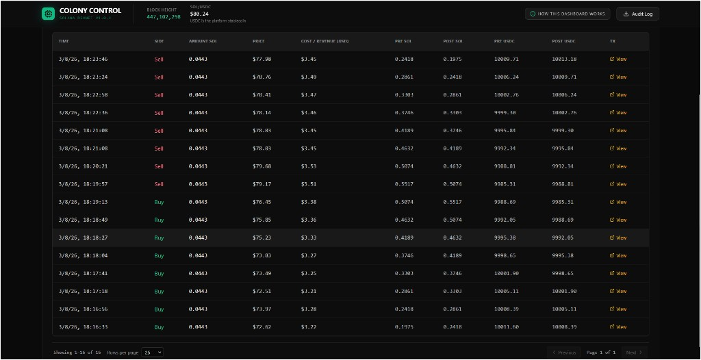

# Agent Colony  - AI Agent Wallet for Solana (Bounty Submission)

**Prototype agentic wallet system: multiple AI agents each with an autonomous wallet, signing transactions and interacting with real Solana devnet protocols (Orca Whirlpools, Memo) without human intervention.**

**Bounty:** [DeFi Developer Challenge - Agentic Wallets for AI Agents](https://superteam.fun/earn/listing/defi-developer-challenge-agentic-wallets-for-ai-agents) (Superteam Nigeria).

**→ Judges:** For a reproducible path and what to look for on-chain, see **[SETUP.md](./SETUP.md)** (clone, env, full demo with USDC, verify on Solscan). Run `npm run demo` after `.env` is set, or follow SETUP.md step-by-step.

---

## Bounty requirements and judging criteria


| Criterion                                              | Where to see it                                                                                                                                  |
| ------------------------------------------------------ | ------------------------------------------------------------------------------------------------------------------------------------------------ |
| **Functional demonstration**                           | Dashboard at [http://localhost:3555](http://localhost:3555); live balances, P&L, real devnet txs. [SETUP.md](./SETUP.md).                        |
| **Security and key management**                        | Encrypted vault, simulate-before-send, rate limit, dry-run. [DEEP_DIVE.md](./DEEP_DIVE.md). Tests: `npm run test:security`.                      |
| **Documentation and deep dive**                        | [DEEP_DIVE.md](./DEEP_DIVE.md)  - wallet design, security, AI agents. [SETUP.md](./SETUP.md)  - how to run.                                         |
| **Scalability: support multiple agents independently** | Default 6 agents; add traders via dashboard; 4-agent or 9+ stress. [SETUP.md](./SETUP.md) §6, `npm run colony:stress`.                            |


---

## Submission checklist


| Requirement                               | Delivered                                                                                                                                                        |
| ----------------------------------------- | ---------------------------------------------------------------------------------------------------------------------------------------------------------------- |
| **Create a wallet programmatically**      | `WalletManager.createWallet(agentId)` + HD derivation via `KeyVault.registerAgent()`  - wallets created on first use, idempotent                                  |
| **Sign transactions automatically**       | `KeyVault.sign(SigningRequest)`  - agents request signing by agent ID; no manual input; keys never leave the vault                                                |
| **Hold SOL and USDC (SPL)**               | Each agent holds SOL and USDC. USDC is the platform stablecoin (pegged to USD). Run `npm run create-usdc-token` after setup for the full demo (each run creates a new mint). `getWalletInfo()` / `getSolBalance()` / `getTokenBalance()`. |
| **Interact with a test dApp or protocol** | **Orca Whirlpools** (swap execution on devnet), **Solana Memo Program** (on-chain decision log), and **System Program** (SOL transfers between agents and vault) |
| **Deep dive**                             | [DEEP_DIVE.md](./DEEP_DIVE.md)  - wallet design, security model, and how the wallet interacts with AI agents                                                      |
| **Open-source, README, setup**            | This repo; instructions below                                                                                                                                    |
| **SKILLS.md for agents**                  | [SKILLS.md](./SKILLS.md)  - written for AI agents (and judges) to understand wallet API and safety constraints                                                    |
| **Working prototype on devnet**           | Yes  - run `npm run setup` then `npm run start`; dashboard at `http://localhost:3555`                                                                             |


---

## What stands out

- **Multiple agents, one vault:** Default 6 agents; add traders via the dashboard "Scale the colony" panel; 4-agent or 9+ stress preset via `AGENT_IDS`.
- **Real protocol interaction:** Orca Whirlpools and Memo on devnet (no mocks).
- **Security-first:** Encrypted vault, simulate-before-send, rate limits, optional `DRY_RUN`.
- **Observability:** Dashboard (SOL/USDC price, USDC balance, P&L, last action) and on-chain memos.
- **Recovery and ops:** Restore from mnemonic; `npm run teardown -- <ADDRESS>` to sweep and reset. See [SETUP.md](./SETUP.md).

---

## Dashboard screenshots

The Colony Control dashboard runs at `http://localhost:3555` and shows live balances, P&L, and on-chain activity. Below are screenshots judges can expect when running the demo.

**Main dashboard - Treasury, Funding & Pool**

Vault (profit sink), Funder (SOL top-up for agents), and Pool (liquidity counterparty for SOL/USDC swaps).


**Traders - autonomous agent cards**

Each trader has its own wallet, volume, USDC balance, and realized/unrealized P&L. Info icons explain each entity.


**SOL/USDC price chart**

Live price with buy (green) and sell (red) markers; T1, T2, T3 denote which trader executed each trade.


**Trader trading history**

Per-trader view: total SOL bought/sold, realized and total P&L, and a table of every trade with pre/post SOL and USDC balances.


**Vault profit history**

Contributions from traders (SOL sent to the vault) with timestamps and transaction links.


**Global trading history table**

All colony trades in one table: side, amount SOL, price, cost/revenue USD, pre/post balances, and TX link.



---

## Architecture (one sentence)

Agent logic decides → requests signing from KeyVault (only place keys exist) → TransactionEngine enforces circuit breakers and simulates → transaction sent to devnet → memos written on-chain.

---

## Quick start (devnet)

```bash
git clone <this-repo>
cd agent-colony
npm install

cp .env.example .env
# Set MASTER_PASSPHRASE (32+ chars). Use quotes if it contains '=':
#   MASTER_PASSPHRASE="your-secret-at-least-32-characters"

npm run demo       # One-command judge/demo flow: setup + build dashboard + start colony
# (Equivalent to: npm run setup && npm run build:dashboard && npm run start)
```

**Full demo (USDC):** Top up the funder wallet with SOL (it pays for USDC mint creation), then run `npm run create-usdc-token` after setup (each run creates a new mint) so traders get 0.2 SOL and 10k USDC, trade SOL/USDC with the pool, and send profit to the vault in USDC. See [SETUP.md](./SETUP.md). The dashboard shows USDC balance on the vault card and USDC balance on pool, funder, and trader cards.

**Optional:** `DRY_RUN=true npm run start`  - agents run and “decide” but no transactions are sent (simulation only). You can also run `npm run colony:dry`.

### Scalability

- **4-agent:** `AGENT_IDS=vault,funder,pool,trader` then `npm run setup` and `npm run start`.
- **6-agent (default):** Leave `AGENT_IDS` unset.
- **9+ stress (dry run):** `npm run colony:stress`. See [SETUP.md](./SETUP.md) §6.

---

## Project layout


| Area                | Role                                                                       |
| ------------------- | -------------------------------------------------------------------------- |
| `src/vault/`        | KeyVault (encrypted HD seed), crypto (AES-256-GCM, Argon2id)               |
| `src/wallet/`       | WalletManager (create wallet, balance, airdrop, build transfer)            |
| `src/agents/`       | Agent logic (Trader, Funder, Pool, Vault); extend BaseAgent for new agents |
| `src/transactions/` | TransactionEngine (circuit breakers, simulate, sign, send), RateLimiter    |
| `src/coordination/` | MemoLogger (on-chain memos), Oracle (mock price)                           |
| `src/dex/`          | OrcaAdapter, PoolAdapter, TraderAdapter (Whirlpools swaps, pool liquidity) |
| `src/dashboard/`    | WebDashboard (HTTP server + live UI at DASHBOARD_PORT)                     |
| `scripts/`          | setup-devnet, restore-vault, create-usdc-token, teardown                   |


---

## Documentation

- **[DEEP_DIVE.md](./DEEP_DIVE.md)**  - Deep dive: wallet design, security considerations, and how the wallet interacts with AI agents.
- **[SETUP.md](./SETUP.md)**  - How to set up, run, and verify: env, commands, full demo with USDC, scalability, troubleshooting.
- **[SKILLS.md](./SKILLS.md)**  - For AI agents and reviewers: wallet API, safety constraints, and how to add agents.

Run `npm run test:security` for attack-simulation tests.

---

## Devnet

- RPC: `SOLANA_RPC_URL` (default: `https://api.devnet.solana.com`).
- After running, inspect addresses on [Solscan (devnet)](https://solscan.io/?cluster=devnet) using the agent addresses printed by `npm run setup` or shown in the dashboard (addresses on each card link to Solscan).

---

## License

ISC.